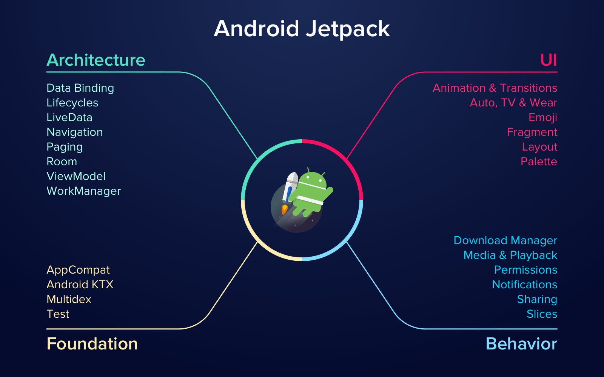

# Android Jetpack


---


| Quick Reference |
| --- |
| [Navigation](https://github.com/devrath/DroidAndroidJetpack/blob/master/README.md#jetpack-navigation "Navigation") |


---


#### What is Android Jetpack library?

* Android Jetpack is a colletion of libraries. It helps Android developers to them solve various tech tasks during the development process. Such tools may accelerate the process of app building and prevent from making a large number of possible bugs. 

* It is a toolkit that is used by our developers to create Android apps for a short period of time without making much effort. This pack includes libraries and special guide. Jetpack has special components that connect the so-called Support Library and Architecture Components. There are four categories that are formed from components mentioned above like Architecture, UI, Foundation, and Behavior.

* Android developers are very much aware that managing the life cycles is not an easy task in android, This collection of libraries help in managing activity lifecycle so that developers can focus more on logic. The libraries take care of handeling configuration changes. Also helping in preventing memory leaks. collectively the complex things are made simple. 

#### Here is a video below describing about android jetpack

<p align="left">
<a href="https://www.youtube.com/watch?v=r8U5Rtcr5UU"></a>
</p>

---

#### Gradle setup

``` android
dependencies {
    def lifecycle_version = "<Add the latest version here>"
    implementation "androidx.lifecycle:lifecycle-livedata-ktx:$lifecycle_version"
    implementation "androidx.lifecycle:lifecycle-viewmodel-ktx:$lifecycle_version"
    ...
}
```

---
<h2>Jetpack Navigation</h2>

<p align="center">
  
</p>


#### What is Jetpack navigation
* This component handles the user-app journey. When the user navigates in the application, the user will go from one screen to another screen based on the complexity of application. 
* Earlier we used to use intents to move from screen to screen and the arguments to pass the sata along with it, Now navigation makes it much simple.
* It uses the pattern where there is one activity nd multiple fragments.
* It creates claees in background and via calling functions, we can move from screen to screen.
* It handles complex cases like bottom tabbed navigation and App drawers, These navigation is handeled in a seamless way and developers do not have to worry about it.

#### Benifits of jetpack Navigation
* Handles fragment transaction by avoiding inconsistensies and memory leaks
* Handles device back and up buttons
* Handles back-stack
* Handles argument passing
* takes care of transistions animations
* Easy way to implement deep-linking

#### How does it work 

<p align="left">
  
</p>

* In the image above we can see that there is representation of flow based on user actions.
* There is a `activity` -> `This activity has a container for the fragment` -> all the screen flows reside in this container
* In the image above `title_screen` and based on the user action there can be two possibilities of navigation and so on.
* Here important thing to note is `backstack` and `navigation` is taken care by the library, no matter how much complex the navigation hierarcy is, developer can rely on the navigation library.

#### Demo represents how the navigation is used in
 * **[Navigation Drawer Activity](app/src/main/java/com/demo/code/navigation/activities/NavigationDrawerActivity.kt)**
 * **[BottomNavigation Activity](app/src/main/java/com/demo/code/navigation/activities/BottomNavigationActivity.kt)**
 * **[TwoFragmentContainerActivity (To show how the app reacts in such scenario)](app/src/main/java/com/demo/code/navigation/activities/TwoFragmentContainerActivity.kt)**

---
<h2>Lifecycle-Aware Components</h2>

<p align="center">
  
</p>

#### what are life-cycle aware components
* Life cycle aware components perform actions in response to a change in the status of another component.
* Components can be such as `activities` and `fragments`
* They help to produce a better organized and light weight code which is easy to maintain.
* Most of app components that are defined in the android framework have life cycles attached to them. life cycles are managed by the `operating system`, If the aplication dosen't follow the rules of the `os`, There may be possibility of memory leaks

#### Building blocks of life-cycle aware components

The life-cycle aware components are made of 3 main parts 

| life-cycle | life-cycle owner | life-cycle observer |
| --- | --- | --- |
| It is a class that holds the information of the information of lifecycle states of components like fragment & activities | This defines the owner of the lifecycle. Activity/Fragment can be called as lifecycle owner | The lifecycle observer observes the state of the life cycle and here we can perform some operation |

#### Use-cases of life-cycle aware components
* Starting/Stopping the video buffering when the application starts and is visible, also stopping the buffering once application is destroyed
* Handeling the location updates, when the application is in foreground /background

#### What order the events are triggered of lifecycle aware components along with actual life-cycle events
* In the activity creation phase, the activity `life-cycle events` are triggered first followed by the `observer events`
* In the activity destruction phase, the `observer events` are triggered followed by the `life-cycle events`

#### Demo represents how the life-cycle aware component is used
* Here we have a activity that is playing a video using the exo-player, This exoplayer is life-cycle aware 
* Activity is binded to a life-cycle aware component
* We can observe all the logic of Exoplayer is moved into the life-cycle aware component even though the life cycle is lifecycle aware 
* This helps to organize our logic seperately 

**[Exoplayer Activity](app/src/main/java/com/demo/code/lifecycle/activities/ExoplayerActivity.kt)**
  <->**[Lifecycle-aware component](app/src/main/java/com/demo/code/lifecycle/util/ExoplayerActivityObserver.kt)**
  ---
