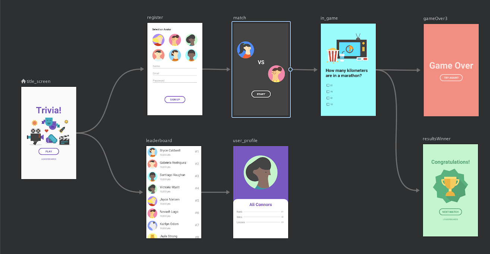
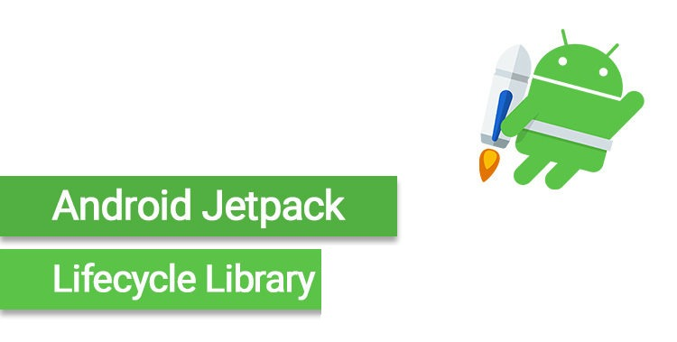

# Android Jetpack


---

Quick Reference

* [Navigation](https://github.com/devrath/DroidAndroidJetpack/blob/master/README.md#jetpack-navigation "Navigation")

---


#### What is Android Jetpack library?

* Android Jetpack is a colletion of libraries. It helps Android developers to them solve various tech tasks during the development process. Such tools may accelerate the process of app building and prevent from making a large number of possible bugs. 

* It is a toolkit that is used by our developers to create Android apps for a short period of time without making much effort. This pack includes libraries and special guide. Jetpack has special components that connect the so-called Support Library and Architecture Components. There are four categories that are formed from components mentioned above like Architecture, UI, Foundation, and Behavior.

* Android developers are very much aware that managing the life cycles is not an easy task in android, This collection of libraries help in managing activity lifecycle so that developers can focus more on logic. The libraries take care of handeling configuration changes. Also helping in preventing memory leaks. collectively the complex things are made simple. 

#### Here is a video below describing about android jetpack

<a href="https://www.youtube.com/watch?v=r8U5Rtcr5UU"></a>

---

#### Gradle setup

``` android
dependencies {
    def lifecycle_version = "<Add the latest version here>"
    implementation "androidx.lifecycle:lifecycle-livedata-ktx:$lifecycle_version"
    implementation "androidx.lifecycle:lifecycle-viewmodel-ktx:$lifecycle_version"
    ...
}
```

---
<h2>Jetpack Navigation</h2>


#### What is Jetpack navigation
* This component handles the user-app journey. When the user navigates in the application, the user will go from one screen to another screen based on the complexity of application. 
* Earlier we used to use intents to move from screen to screen and the arguments to pass the sata along with it, Now navigation makes it much simple.
* It uses the pattern where there is one activity nd multiple fragments.
* It creates claees in background and via calling functions, we can move from screen to screen.
* It handles complex cases like bottom tabbed navigation and App drawers, These navigation is handeled in a seamless way and developers do not have to worry about it.

#### Benifits of jetpack Navigation
* Handles fragment transaction by avoiding inconsistensies and memory leaks
* Handles device back and up buttons
* Handles back-stack
* Handles argument passing
* takes care of transistions animations
* Easy way to implement deep-linking

#### How does it work 



* In the image above we can see that there is representation of flow based on user actions.
* There is a `activity` -> `This activity has a container for the fragment` -> all the screen flows reside in this container
* In the image above `title_screen` and based on the user action there can be two possibilities of navigation and so on.
* Here important thing to note is `backstack` and `navigation` is taken care by the library, no matter how much complex the navigation hierarcy is, developer can rely on the navigation library.

#### Demo represents how the navigation is used in
 * **[Navigation Drawer Activity](app/src/main/java/com/demo/code/navigation/activities/NavigationDrawerActivity.kt)**
 * **[BottomNavigation Activity](app/src/main/java/com/demo/code/navigation/activities/BottomNavigationActivity.kt)**
 * **[TwoFragmentContainerActivity (To show how the app reacts in such scenario)](app/src/main/java/com/demo/code/navigation/activities/TwoFragmentContainerActivity.kt)**

---
<h2>Lifecycle-Aware Components</h2>



